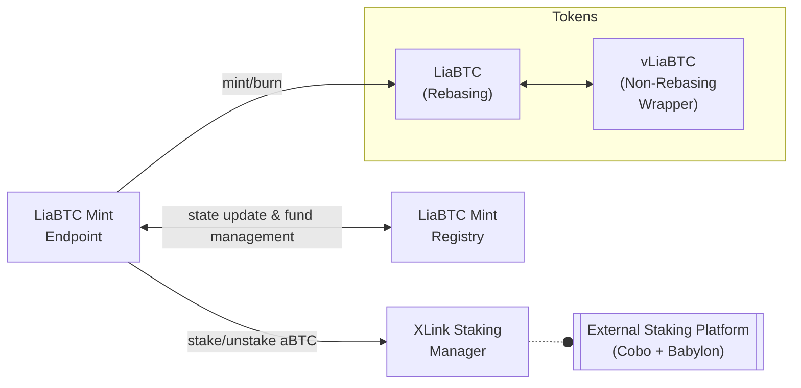

# Contracts

LISA, acronym for Liquid Staking for All, is deployed and functioning within the Stacks blockchain network. This document aims to serve both as an index and an overarching overview of the LISA on-chain ecosystem.

At the top of the on-chain architecture is the [LISA DAO](https://docs.lisalab.io/governance/lisa-dao).

## LISA DAO

| Contract  | Principal                                                                |
| --------- | ------------------------------------------------------------------------ |
| Executor  | [`'SM26NBC8SFHNW4P1Y4DFH27974P56WN86C92HPEHH.lisa-dao`][lisa-dao]        |
| Operators | [`'SM26NBC8SFHNW4P1Y4DFH27974P56WN86C92HPEHH.operators`][lisa-operators] |

## Liquid Staking Modules

### LiaBTC

| Contract              | Principal                                                                                | Enabled DAO Extension |
| --------------------- | ---------------------------------------------------------------------------------------- | --------------------- |
| LiaBTC Mint Endpoint  | [`'SP673Z4BPB4R73359K9HE55F2X91V5BJTN5SXZ5T.liabtc-mint-endpoint`][liabtc-mint-endpoint] | Yes                   |
| LiaBTC Mint Registry  | [`'SP673Z4BPB4R73359K9HE55F2X91V5BJTN5SXZ5T.liabtc-mint-registry`][liabtc-mint-registry] | Yes                   |
| LiaBTC Token          | [`'SP673Z4BPB4R73359K9HE55F2X91V5BJTN5SXZ5T.token-liabtc`][token-liabtc]                 | Yes                   |
| vLiaBTC Token         | [`'SP673Z4BPB4R73359K9HE55F2X91V5BJTN5SXZ5T.token-vliabtc`][token-vliabtc]               | Yes                   |
| XLink Staking Manager | [`'SP673Z4BPB4R73359K9HE55F2X91V5BJTN5SXZ5T.xlink-staking`][xlink-staking]               | Yes                   |

[lisa-dao]: https://explorer.stxer.xyz/txid/SM26NBC8SFHNW4P1Y4DFH27974P56WN86C92HPEHH.lisa-dao
[lisa-operators]: https://explorer.stxer.xyz/txid/SM26NBC8SFHNW4P1Y4DFH27974P56WN86C92HPEHH.operators
[liabtc-mint-registry]: https://explorer.stxer.xyz/txid/SP673Z4BPB4R73359K9HE55F2X91V5BJTN5SXZ5T.liabtc-mint-registry
[liabtc-mint-endpoint]: https://explorer.stxer.xyz/txid/SP673Z4BPB4R73359K9HE55F2X91V5BJTN5SXZ5T.liabtc-mint-endpoint
[token-liabtc]: https://explorer.stxer.xyz/txid/SP673Z4BPB4R73359K9HE55F2X91V5BJTN5SXZ5T.token-liabtc
[token-vliabtc]: https://explorer.stxer.xyz/txid/SP673Z4BPB4R73359K9HE55F2X91V5BJTN5SXZ5T.token-vliabtc
[xlink-staking]: https://explorer.stxer.xyz/txid/SP673Z4BPB4R73359K9HE55F2X91V5BJTN5SXZ5T.xlink-staking
