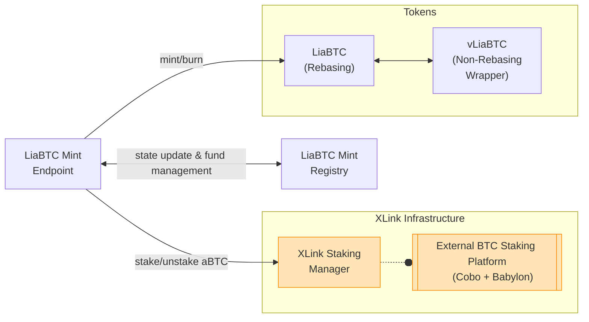

# Contracts

LISA is deployed and functioning within the Stacks blockchain network. This document aims to serve both as an index and an overarching overview of the LISA on-chain ecosystem.

## Governance

At the top of the on-chain architecture is the LISA DAO, accounting for LISA's governance in a rule-based, modular and flexible manner. Built upon Marvin Janssen's ExecutorDAO project, it operates based on the following core principles:

1. Proposals are smart contracts.
2. The core executes, the extensions give form.
3. Ownership control happens via sending context.

For technical details on the ExecutorDAO, refer to the project's [README.md](https://github.com/MarvinJanssen/executor-dao#readme). To understand how the ExecutorDAO is customized and implemented within LISA, visit the dedicated [LISA DAO](https://docs.lisalab.io/governance/lisa-dao) governance page in the documentation.

## Liquid Staking

### aBTC as LiaBTC

`aBTC`, or [ALEX BTC](https://medium.com/alexgobtc/abtc-from-alex-a-practical-step-towards-bitcoin-defi-ccb6ec684d87), is a Stacks SIP-010 token pegged 1:1 to Bitcoin. `LiaBTC` is a rebasing token for `aBTC`, while `vLiaBTC` is its non-rebasing, value-accruing wrapper.

#### Relations Diagram

#### LiaBTC Mint Endpoint

- Contract name: `liabtc-mint-endpoint`
- [Complete technical documentation](liabtc-mint-endpoint.md)

The Mint Endpoint serves as the users' operational interface to stake and unstake `aBTC`, facilitating the minting and burning of `LiaBTC`. It relies on the XLink Staking Manager to handle the liquid staking pool management.

#### LiaBTC Mint Registry

- Contract name: `liabtc-mint-registry`
- [Complete technical documentation](liabtc-mint-registry.md)

The Mint Registry functions as the persistence and treasury module for the Mint Endpoint operations.

#### Token LiaBTC

- Contract name: `token-liabtc`
- [Complete technical documentation](token-liabtc.md)

Implementation of the `LiaBTC` rebasing token that represents staked `aBTC`. The underlying Bitcoin backing these `aBTC` tokens is staked externally utilizing the XLink on-chain and off-chain infrastructure. The lifecycle of the token invoves minting when `aBTC` is submitted for staking and burning upon unstaking. When users stake `aBTC` through the Mint Endpoint, they receive `LiaBTC` at a 1:1 ratio.

#### Token vLiaBTC

- Contract name: `token-vliabtc`
- [Complete technical documentation](token-vliabtc.md)

Implementation of the `vLiaBTC` value-accruing token, designed as a non-rebasing wrapper for `LiaBTC`. It is mainly used as a layer of compatibility to integrate `LiaBTC` with other DeFi protocols. Users can wrap their `LiaBTC` into `vLiaBTC` to maintain the same value in a non-rebasing format.

#### XLink Staking Manager

- Contract name: `xlink-staking`
- [Complete technical documentation](https://docs.xlink.network/developers/contracts/xlink-staking)

The XLink Staking Manager is a generic contract designed to manage liquid staking pools for multiple tokens and track staker positions within each pool. It is part of a hybrid, token-agnostic liquid staking management system, that operates alongside off-chain backend and frontend components managed by XLink.


This contract is part of [XLink](https://docs.lisalab.io/ecosystem-partners/xlink) ecosystem and is governed by the XLink DAO.


## Deployed contracts


Page under construction. This is not an exhaustive list.


### Governance

- ExecutorDAO: [`'SM26NBC8SFHNW4P1Y4DFH27974P56WN86C92HPEHH.lisa-dao`][lisa-dao]
- Operators: [`'SM26NBC8SFHNW4P1Y4DFH27974P56WN86C92HPEHH.operators`][operators]

### aBTC Liquid Staking

- LiaBTC Mint Endpoint: [`'SP673Z4BPB4R73359K9HE55F2X91V5BJTN5SXZ5T.liabtc-mint-endpoint`][liabtc-mint-endpoint]
- LiaBTC Mint Registry: [`'SP673Z4BPB4R73359K9HE55F2X91V5BJTN5SXZ5T.liabtc-mint-registry`][liabtc-mint-registry]
- LiaBTC Token: [`'SP673Z4BPB4R73359K9HE55F2X91V5BJTN5SXZ5T.token-liabtc`][token-liabtc]
- vLiaBTC Token: [`'SP673Z4BPB4R73359K9HE55F2X91V5BJTN5SXZ5T.token-vliabtc`][token-vliabtc]
- XLink Staking Manager: [`'SP673Z4BPB4R73359K9HE55F2X91V5BJTN5SXZ5T.xlink-staking`][xlink-staking]

[lisa-dao]: https://explorer.stxer.xyz/txid/SM26NBC8SFHNW4P1Y4DFH27974P56WN86C92HPEHH.lisa-dao
[operators]: https://explorer.stxer.xyz/txid/SM26NBC8SFHNW4P1Y4DFH27974P56WN86C92HPEHH.operators
[liabtc-mint-registry]: https://explorer.stxer.xyz/txid/SP673Z4BPB4R73359K9HE55F2X91V5BJTN5SXZ5T.liabtc-mint-registry
[liabtc-mint-endpoint]: https://explorer.stxer.xyz/txid/SP673Z4BPB4R73359K9HE55F2X91V5BJTN5SXZ5T.liabtc-mint-endpoint
[token-liabtc]: https://explorer.stxer.xyz/txid/SP673Z4BPB4R73359K9HE55F2X91V5BJTN5SXZ5T.token-liabtc
[token-vliabtc]: https://explorer.stxer.xyz/txid/SP673Z4BPB4R73359K9HE55F2X91V5BJTN5SXZ5T.token-vliabtc
[xlink-staking]: https://explorer.stxer.xyz/txid/SP673Z4BPB4R73359K9HE55F2X91V5BJTN5SXZ5T.xlink-staking
