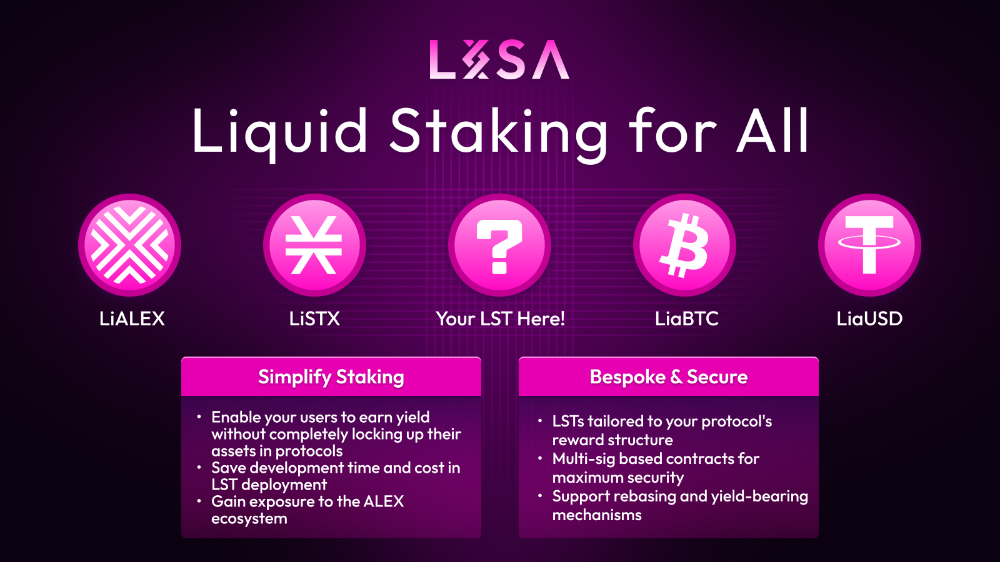

# List with LISA!

<figure><figcaption></figcaption></figure>

Staking is a popular strategy used by DAOs, protocols, and projects, where you hold and lock up cryptocurrency to help run, secure, earn incentives and etc.

However, each project handles rewards differently based on its setup. This can make it tough for new users to figure out how to earn rewards, as it might require a lot of research and effort.&#x20;

Additionally, some projects set a minimum amount needed to start staking, which might exclude smaller investors from earning rewards.

Enter liquid staking tokens (LSTs), which solve the issues of minimum balances and cumbersome processes. Yet, not every project can afford to create their own LSTs for their native tokens.

This is where LISA comes in—LISA provides a custom LST solution for your project's tokens.

**In short, LSTs:**

* Are easier for anyone to participate in—usually with a simple swap.
* Are accessible to smaller accounts by removing staking amount limitations and eliminating the hassle of complicated staking processes.
* Enable your community to expand into more DeFi opportunities without missing out on the staking rewards of your native tokens.

### Why Launch your LST with LISA? 

LISA has a proven track record of launching 3 and counting numbers of LSTs with each of them designed in a bespoke manner:

* **STX ->** [**LiSTX**](https://docs.lisalab.io/~/changes/nTd2kdqu4i8fnOkHTWmm/supported-tokens/stx)**:** Rewards from securing the Stacks network via the Proof-of-Exchange mechanism.
* B**TC ->** [**LiaBTC**](https://docs.lisalab.io/~/changes/nTd2kdqu4i8fnOkHTWmm/supported-tokens/bitcoin-usdbtc)**:** Rewards from Babylon via the COBO API. The staked BTC is used to secure Proof of Stake (PoS) chains and generate yield.
* **ALEX ->** [**LiALEX**](https://docs.lisalab.io/~/changes/nTd2kdqu4i8fnOkHTWmm/supported-tokens/alex)**:** Rewards from ALEX reward emissions for participating in the ALEX Ecosystem.
* **(Incoming) aUSD -> LiaUSD:** Rewards from US Treasury yields; Real World Asset (RWA) yields.

Unlike LST platforms like Sanctum from Solana, which only support one type of asset, $SOL, on a single network, LISA develops bespoke LSTs and supports a wide range of assets.

Additionally, it enables you to bridge your tokens to more than 16 different networks listed in the [Supported Networks](https://docs.lisalab.io/~/changes/nTd2kdqu4i8fnOkHTWmm/developers/lisa-supported-network), powered by [XLink](https://docs.lisalab.io/~/changes/nTd2kdqu4i8fnOkHTWmm/ecosystem-partners/xlink).

### How LISA LST Works? 

1. Instead of committing funds into a contract that locks up funds indefinitely for yields, LISA will use your committed funds to stake on your behalf. In exchange, you will receive LSTs as returns; LSTs are on-chain IOU tokens.
2. LISA LSTs are issued as liquid staking tokens each time a user commits funds into the LISA contract. These LSTs can be redeemed whenever a user requests to unstake them, along with the rewards generated from the amount you committed to LISA.
3. The rewards are generated each time depending on the mechanism of the tokens we support; for example, the reward structures for LiaBTC and LiSTX are not the same. However, with each reward cycle that passes, LISA will channel those rewards into your LSTs.

### Requirements to LST with LISA 

It's important to note that even though LISA provides bespoke solutions for LST creation, not every token can be converted into LSTs.

Here are some of the requirements that must be met:

* The token must currently support staking features (we support both Permissioned and Permissionless).
* The token must have continuous staking with a uniform unstake delay and a short, uniform stake delay (maximum 3 days). For example, a user can stake at any time with up to a 3-day delay in the start of staking, and can unstake at any time with a delay in receiving unstaked tokens. The reward cycle duration cannot be random.
* The staking reward, schedule, and structure must be clearly laid out, showing how rewards are earned and distributed to staked tokens.
* Your project must obtain and pass audits from notable auditing firms to ensure that your smart contracts meet the safety requirements.
* The LISA team needs to review/approve the staking contract and may require audit reports.

If all of the above requirements are met, the LISA team can provide the integration and create your LST for your community!
