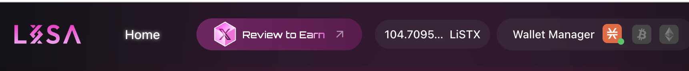

# Checking your Balance

<figure><figcaption></figcaption></figure>

To check your balance, simply open any LISA page, and the balance will be displayed alongside the header section.&#x20;

This feature has been introduced because most explorers or even wallets lack rebasing support; hence, to accurately check your balance, you would need to do so via the LISA website."
