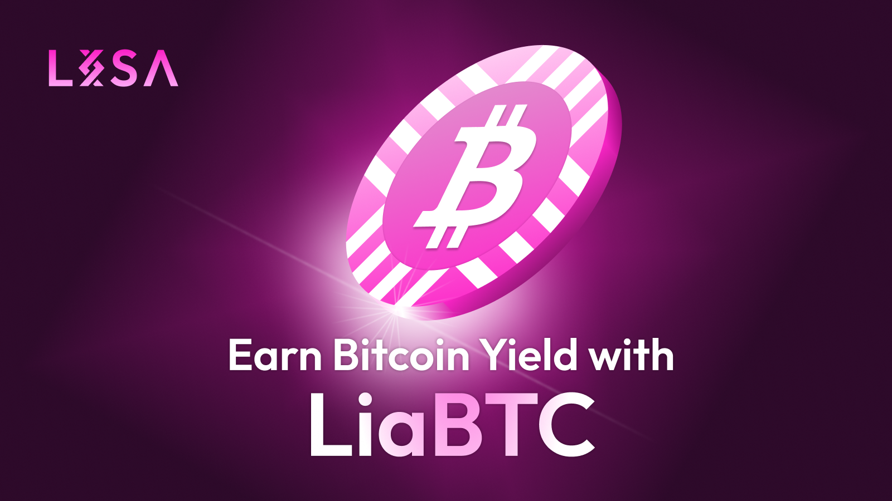

# Bitcoin ($BTC)

<figure><figcaption></figcaption></figure>

**LiaBTC** is a rebasing tokens for aBTC.

aBTC is designed to have the same value as Bitcoin, maintaining a 1:1 ratio (1 aBTC = 1 BTC). It's created on the Stacks platform, which enables smart contracts and apps for Bitcoin, thereby aiming to expand the utility of Bitcoin within decentralized finance (DeFi).&#x20;

## 1 LiaBTC = 1 aBTC 

LiaBTC rebasing mechanism is similar to other LISA rebasing token mechanism.

### How Long to Stake In and Out?

You can stake your BTC to LiaBTC immediately; however, to unstake, you would need to wait 1,000 Bitcoin blocks for your LiaBTC to be converted back to BTC.

* **Stake In:** Immediate
* **Stake Out:** 1,000 Bitcoin blocks

