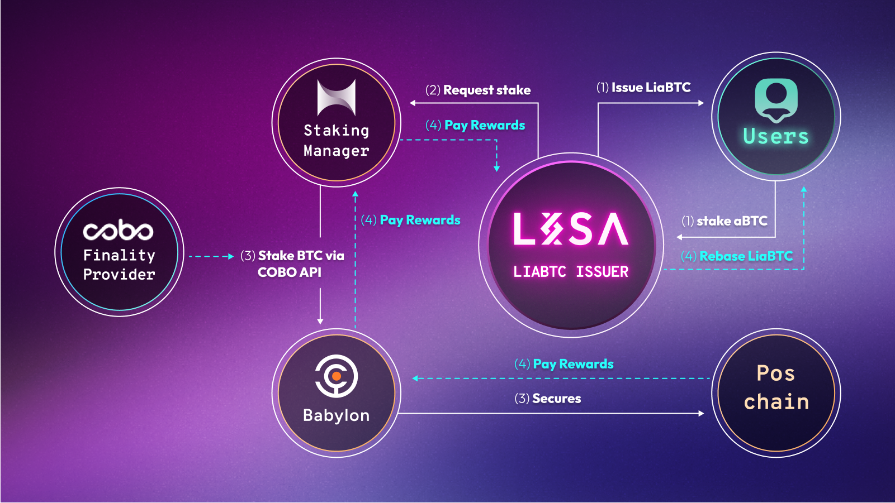

# How LiaBTC utilizes COBO?

<figure><figcaption></figcaption></figure>

XLink, in partnership with COBO as the custodian of BTC reserves, instructs COBO to securely stake the relevant Bitcoin on the Babylon platform. The underlying Bitcoin that backs the aBTC is staked at Babylon, with COBO serving as the finality provider to ensure security and the irreversibility of transactions.

As rewards from the staking process accrue, LiaBTC balances automatically increase, ensuring a continuous stream of rewards for holders.

Similar to other liquid staking products offered by LISA, LiaBTC is a rebase token, meaning its supply adjusts based on rewards, ensuring continuous compounding without manual reinvestment.

\
